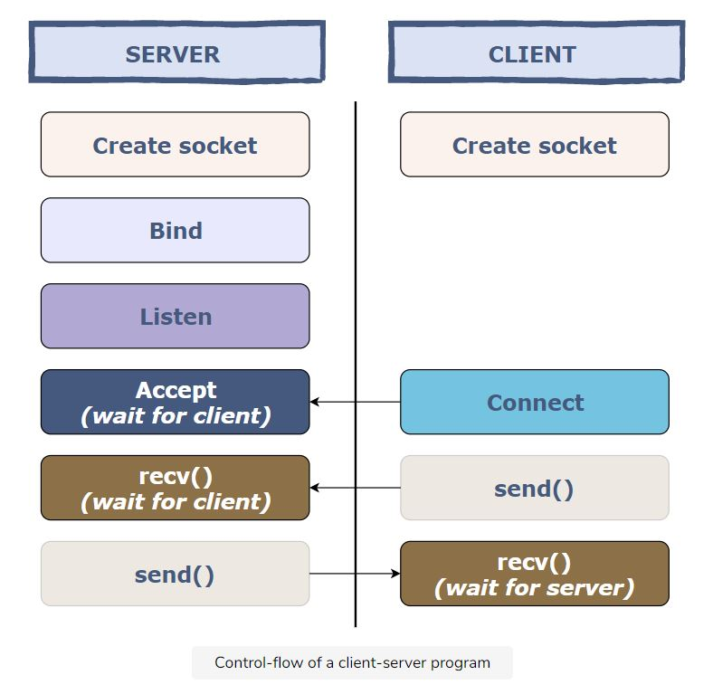
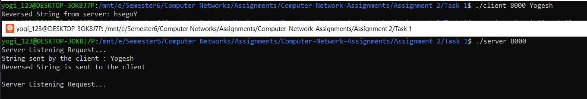

# C Program to reverse the string
Build connection-oriented (TCP) client server model. Client sends the string to the server and server reverses the string sent by the client and sends it back to the client.
 - Sample Input: The Client sends the string “CNLAB”
 - Sample Output The string will get back as reverse “BALNC”

## Client Server Model

###### Image by Educative.io

## Output
