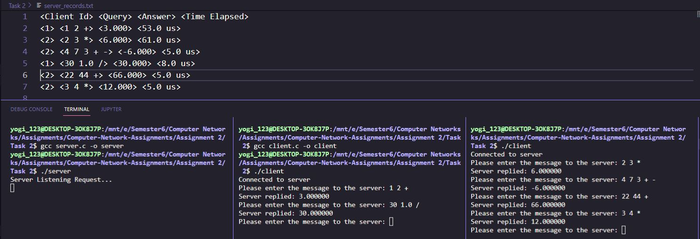

# Multi-Process Server
 - TCP server (handles requests for multiple users).
 - TCP clients.

Server program is be a multi-process server that “fork” a process for every new client it receives. Multiple clients are be able to simultaneously chat with the server.

# Output
